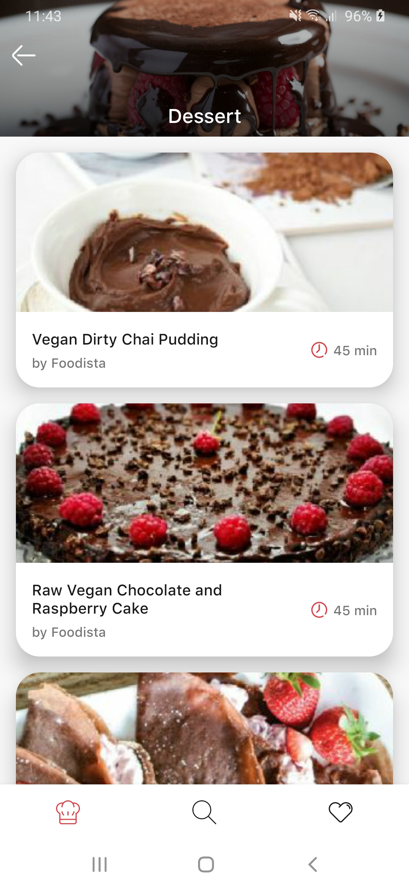

# Peky Recipes App
Personal project developed with the Android SDK.

All recipe information is provided by [Spoonacular API.](https://spoonacular.com/food-api) 

## Features
- List of recipe categories
- Search recipes from the network
- Infinite scroll with pagination
- Save your favorite recipes in a local database
- Share recipes
- Navigation with deep linking
- Visit original recipe website within a webview
- Transitions with Material Motion and MotionLayout
- Dark theme support

## Libraries Used
- Android KTX
- Kotlin Coroutines
- View Binding
- LiveData
- ViewModel
- Navigation
- Room
- Retrofit
- Hilt
- Glide
- DataStore
- Paging 3
## Screenshots

  
    
   

  
    
   

